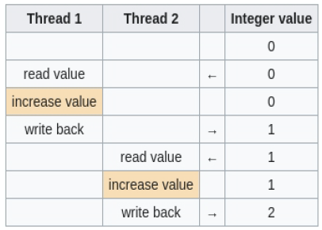
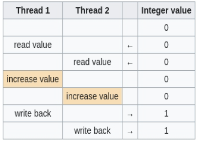

<!-- markdownlint-disable MD041 MD033 MD024 MD026 -->
title:Concurrence, les threads
intro:la présentera nous gestion la de Golang concurrence en.
conclusion:Vu la gestion de la concurrence Golang.

---

### Concurrence et parallélisme

- Quelle différence ?
  
  - Concurrence: effectuer plusieurs tâches sans attendre d'en finir une pour en commencer une autre.
  
  Ex : écrire deux textes différents sur deux feuilles de papier, en écrivant une ligne de chaque texte à la fois.

---

- Quelle différence ?

- Parallélisme: effectuer plusieurs tâches simultanément.

  Ex : écrire les deux textes en même temps, avec un stylo dans chaque main.

---

### Rappels sur les threads

- Un thread est un "fil d'exécution" de votre programme.

- Il existe deux types de threads : les "threads lourds", ou "threads système", et les green-threads, ou "threads légers"

---

### Rappels sur les threads

- Un thread lourd est un thread géré par l'OS. Il est dit lourd parce que généralement plus coûteux en ressources
  - Il faut communiquer avec l'OS pour le manipuler.
- Un green thread est plus léger, il est géré par le runtime du programme.

---

### Pourquoi les threads ?

- Pour les performances

- Pour les opérations bloquantes

---

### Threads, inconvénients

- La programmation d'un code multithreaded est plus difficile.

- Il y a des risques qui n'existent pas dans la programmation non-threaded. Ex : deadlock, data races...

---

### Threads, mémoire

- La mémoire n'est pas automatiquement synchronisée entre les threads.

- Si on partage un objet entre plusieurs threads, cela peut causer des problèmes (data races).

---

<!-- _class: hide-footer -->

### Threads, mémoire

- Comment est gérée la mémoire ?
- Exemple pour illustrer les data races, sur l'opération : compteur = compteur+1

::: columns



Pas de data race



Data race

:::

---

### Threads, mémoire

- Comment synchroniser ?
  
- Avec des mutexes
  
- Avec des channels => En Go on fait plutôt ça.
  
  => "Partagez de la mémoire en communiquant, et non pas, partagez de la mémoire pour communiquer."
  
---

### Mutex

- Ce sont des objets qui permettent de réguler l'accès aux données.
  - Ils permettent par exemple qu'un seul thread y accède à la fois.
- Penser à un verrou. Lorsqu'un thread accède à une donnée, elle ferme le verrou et garde la clé.
  - Lorsque les opérations sont finies pour la donnée, ne pas oublier de libérer le verrou !
- Deadlock ?

---

### Threads en go

- Ils sont appelés "goroutines".

- Ce sont des green threads : le runtime se charge de tout pour nous.
Lorsqu'un thread lourd est nécessaire pour l'exécution du programme, le runtime se charge de le créer pour nous.

- Attention quand le thread de votre fonction **main** se termine, le programme se termine aussi...
  - ... que les autres threads soient finis ou non !

---

### Threads en go : goroutine

- Comment les lancer ?

- Mot clé "go"

```golang  
func main(){
  go maFunc() e// Lance une goroutine qui exécute "maFunc()"
}

func maFunc(){
  fmt.Println("je ne fais rien !")
}
```

---

### Threads en go

Pourquoi est-ce que le programme précédent n'affiche quasiment jamais rien ?

* La goroutine qui doit print est lancée, mais le thread de main() se termine immédiatement, et donc le programme aussi.
  
* La goroutine qui doit print est tuée avant d'avoir pu afficher quoi que ce soit.

---

### Threads en go

On va parler des channels, mais pas des mutexes en Go.
