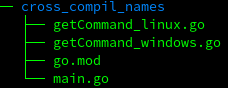

<!-- markdownlint-disable MD041 MD033 MD024 MD026 -->
title:La cross compilation
intro:nous expliquera la cross compilation.
conclusion:La cross compilation en Go.

---

### Cross compilation & static linking

- Possibilité de compiler pour "n'importe quelle" plateforme. Lister les targets possibles :

```shell
go tool dist list
```

---

<!-- _footer: "" -->

### Cross compilation & static linking

- Les binaires sont "self contained", "statically linked" : aucune dépendance au runtime

- Pour choisir une plateforme, il suffit de définir une variable d'environnement :
  - GOARCH pour l'architecture
  - GOOS pour la plateforme

```shell
GOARCH=amd64 GOOS=linux go build ./...
```

---

### Comment spécifier au compilateur qu'on aimerait compiler tel code pour tel OS ?

- En C par exemple, on peut mettre des headers.

- En Go, on a plusieurs méthodes : noms de fichiers et annotations.

---

### Instructions compilateur et noms de fichiers

- Il suffit de nommer ses fichiers avec un suffixe qui est le target de la plateforme pour laquelle on veut compiler.

- On a la liste des plateformes avec la commande donnée précédemment.

```shell
go tool dist list
```

---

### Exemple de structure



---

### Fichier Linux (getCommand_linux.go) :

```golang
func GetCommand() []string{
   return []string{"ifconfig", "-a"}
}
```

### Fichier Windows (getCommand_windows.go) :

```golang
func GetCommand() []string{
   return []string{"ipconfig", "/all"}
}
```

---

### Fichier main (tronqué) :

```golang
cmd := GetCommand()
out,err := exec.Command(cmd[0], cmd[1:]...).Output()
```

---

- Instructions compilateur et annotations :

  - Il est également possible d'utiliser des annotations pour les instructions.

  - C'est plus flexible, et plus "propre".

---

### Instructions compilateur et annotations :

- Supposons que l'on ait 4 targets différents à couvrir :
  MacOS, Windows (32bits), Openbsd, Linux.
- On pourrait faire 4 fichiers différents... Mais.

---

Plutôt que de faire 4 fichiers, on factorise et on utilise des annotations comme ceci :

- Fichier Unix (getCommand_unix.go) :

```golang
// +build linux darwin openbsd
func GetCommand() []string{
  return []string{"ifconfig", "-a"}
}
```

- Fichier Windows (getCommand_windows.go):

```golang
// +build windows,386
func GetCommand() []string{
  return []string{"ipconfig", "/all"}
}
```

- Fichier main : inchangé.

---

Référence :
<https://golang.org/cmd/go/###hdr-Build_constraints>