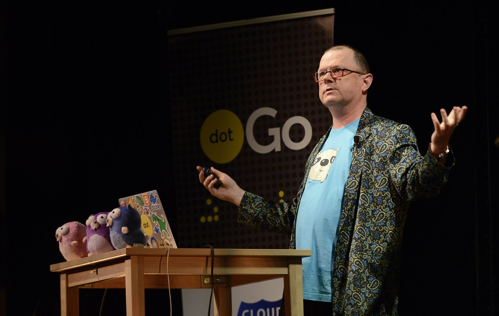

<!-- markdownlint-disable MD041 MD033 MD024 MD026 -->
title:Golang, origine
intro:nous présentera les bases du langage Golang.
conclusion:Les bases du langage Golang.

---

- Né chez Google en 2007
- Principalement conçu par :

::: columns
  
  *Ken Thompson*
  
  *Rob Pike*
:::

<!-- speaker notes FTW!-->

---

### Pourquoi ?


---

### Pourquoi ?

- Temps de compilation du C++ trop longs
- Besoin de typage statique

```python
def multiplyByFour(argsList):
  output = ????

  for arg in argsList:
    output += arg - 4

  return output
# (pour rappel, ceci est valide en python:
# argsList = ["name1", "long name1", 1, 2, 3])
```

---

### Concrètement

- Un langage à syntaxe "C-like", impératif
- **Pas de POO** ("Composition over inheritance")
- Compilé
- Statiquement typé (avec inférence de type)
  - Pas indiqués explicitement dans le code source

---

### Avantages

- Bibliothèque standard et des outils très complets
- Concurrence et parallélisme
- Garbage collection et sécurité mémoire
- Cross Compilation et static linking

---

### Bibliothèque ?

- Bibliothèque standard très complète (<https://golang.org/pkg/>) :
  http, archives (tar, zip, bzip...), crypto, driver de DB, XML, JSON, hashing, testing, os...

---

### Outils ?

Et des outils complets :

- go fmt (formatting automatique du code)
- go mod (vendoring)
- go doc
- go test
- go install
...

Voir ici : <https://golang.org/cmd/go/>
